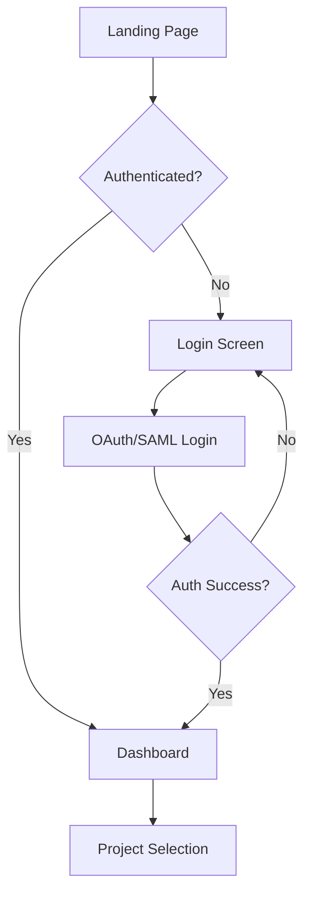
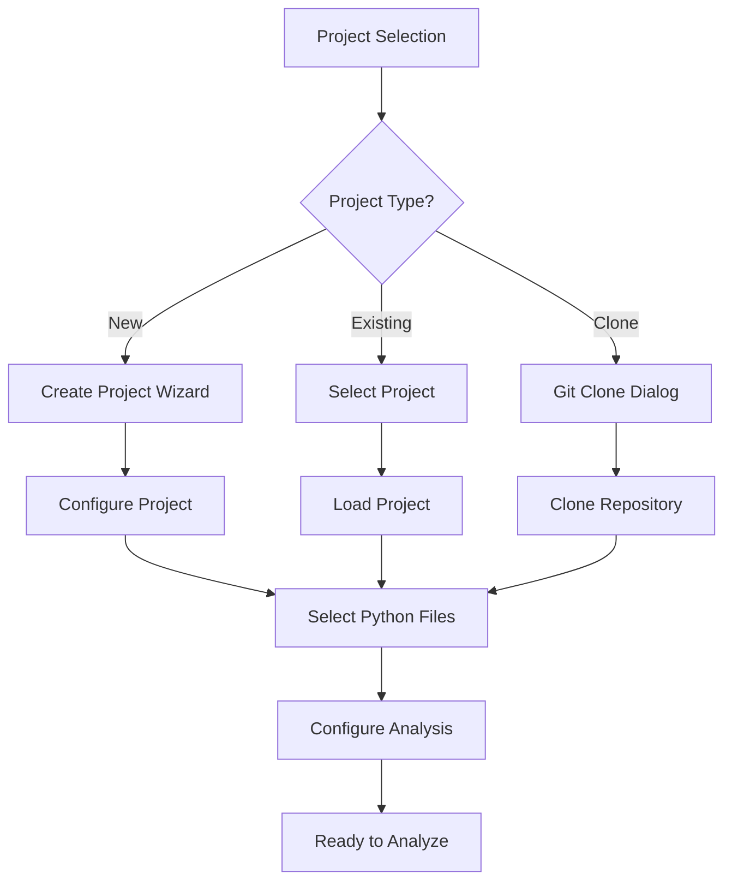
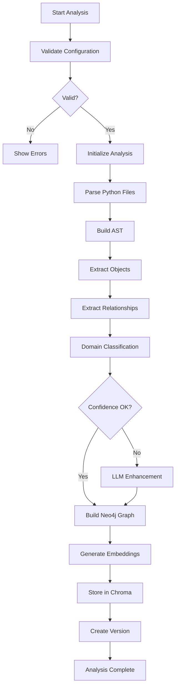

# Python Codebase Debugging Utility - Application Flow & States

## 1. Application State Architecture

### 1.1 Global Application States
```typescript
enum AppState {
  INITIAL = "initial",
  PROJECT_SELECTION = "project_selection",
  PROJECT_LOADING = "project_loading",
  PROJECT_READY = "project_ready",
  ANALYSIS_RUNNING = "analysis_running",
  ANALYSIS_COMPLETE = "analysis_complete",
  ERROR = "error",
  MAINTENANCE = "maintenance"
}
```

### 1.2 User Authentication States
```typescript
enum AuthState {
  UNAUTHENTICATED = "unauthenticated",
  AUTHENTICATING = "authenticating",
  AUTHENTICATED = "authenticated",
  SESSION_EXPIRED = "session_expired",
  AUTH_ERROR = "auth_error"
}
```

### 1.3 Project States
```typescript
enum ProjectState {
  NOT_LOADED = "not_loaded",
  LOADING = "loading",
  LOADED = "loaded",
  PARSING = "parsing",
  ANALYZED = "analyzed",
  ARCHIVED = "archived"
}
```

### 1.4 Analysis States
```typescript
enum AnalysisState {
  NOT_STARTED = "not_started",
  PREPARING = "preparing",
  PARSING_AST = "parsing_ast",
  EXTRACTING_RELATIONSHIPS = "extracting_relationships",
  CLASSIFYING_DOMAINS = "classifying_domains",
  BUILDING_GRAPH = "building_graph",
  GENERATING_EMBEDDINGS = "generating_embeddings",
  STORING_VERSION = "storing_version",
  COMPLETE = "complete",
  FAILED = "failed",
  CANCELLED = "cancelled"
}
```

## 2. Main User Flow

### 2.1 Initial Setup Flow


### 2.2 Project Setup Flow


### 2.3 Analysis Flow


## 3. Detailed State Flows

### 3.1 Project Creation States
```
INITIAL
  └── PROJECT_CREATION_START
      ├── PROJECT_TYPE_SELECTION
      │   ├── LOCAL_FOLDER_SELECTED
      │   ├── GIT_REPO_SELECTED
      │   └── NEW_PROJECT_SELECTED
      ├── PROJECT_CONFIGURATION
      │   ├── NAME_ENTRY
      │   ├── PATH_SELECTION
      │   ├── FILE_FILTER_SETUP
      │   └── EXCLUSION_RULES
      └── PROJECT_VALIDATION
          ├── VALIDATING_PATH
          ├── CHECKING_PERMISSIONS
          └── CREATING_WORKSPACE
```

### 3.2 Analysis Pipeline States
```
ANALYSIS_INITIATED
  └── PREPROCESSING
      ├── WORKSPACE_PREPARATION
      │   ├── COPYING_FILES
      │   ├── CREATING_TEMP_DIRECTORY
      │   └── VALIDATING_FILE_STRUCTURE
      └── CONFIGURATION_LOADING
          ├── LOADING_PREVIOUS_SETTINGS
          ├── APPLYING_DEFAULTS
          └── VALIDATING_DEPENDENCIES

PARSING_PHASE
  └── AST_PARSING
      ├── FILE_DISCOVERY
      │   ├── SCANNING_DIRECTORIES
      │   ├── FILTERING_FILES
      │   └── BUILDING_FILE_LIST
      ├── PARALLEL_PARSING
      │   ├── WORKER_INITIALIZATION
      │   ├── FILE_DISTRIBUTION
      │   └── PROGRESS_TRACKING
      └── PARSE_COMPLETION
          ├── COLLECTING_RESULTS
          ├── ERROR_AGGREGATION
          └── AST_VALIDATION

RELATIONSHIP_EXTRACTION
  └── DEPENDENCY_ANALYSIS
      ├── IMPORT_RESOLUTION
      │   ├── STANDARD_LIBRARY
      │   ├── THIRD_PARTY
      │   └── LOCAL_IMPORTS
      ├── CALL_GRAPH_BUILDING
      │   ├── METHOD_CALLS
      │   ├── FUNCTION_CALLS
      │   └── ATTRIBUTE_ACCESS
      └── TYPE_ANALYSIS
          ├── TYPE_INFERENCE
          ├── STUB_MATCHING
          └── GENERIC_RESOLUTION

DOMAIN_CLASSIFICATION
  └── CLASSIFICATION_PIPELINE
      ├── STATIC_ANALYSIS
      │   ├── PATTERN_MATCHING
      │   ├── HEURISTIC_RULES
      │   └── CONFIDENCE_SCORING
      ├── AI_CLASSIFICATION
      │   ├── CHUNK_PREPARATION
      │   ├── LLM_REQUESTS
      │   └── RESPONSE_PARSING
      └── CONSENSUS_BUILDING
          ├── MULTI_MODEL_VOTING
          ├── CONFIDENCE_AGGREGATION
          └── FINAL_CLASSIFICATION

GRAPH_CONSTRUCTION
  └── NEO4J_OPERATIONS
      ├── BACKUP_EXISTING
      │   ├── EXPORT_CURRENT_GRAPH
      │   ├── STORE_BACKUP_METADATA
      │   └── VERIFY_BACKUP
      ├── GRAPH_BUILDING
      │   ├── NODE_CREATION
      │   ├── RELATIONSHIP_CREATION
      │   └── PROPERTY_ASSIGNMENT
      └── GRAPH_ENRICHMENT
          ├── ALGORITHM_EXECUTION
          ├── METRIC_CALCULATION
          └── INDEX_CREATION

EMBEDDING_GENERATION
  └── VECTOR_PROCESSING
      ├── CODE_CHUNKING
      │   ├── METHOD_EXTRACTION
      │   ├── CLASS_EXTRACTION
      │   └── CONTEXT_PRESERVATION
      ├── EMBEDDING_CREATION
      │   ├── BATCH_PROCESSING
      │   ├── MODEL_INFERENCE
      │   └── VECTOR_VALIDATION
      └── CHROMA_STORAGE
          ├── COLLECTION_CREATION
          ├── VECTOR_INSERTION
          └── METADATA_LINKING

VERSION_MANAGEMENT
  └── VERSION_CREATION
      ├── SNAPSHOT_GENERATION
      │   ├── STATE_CAPTURE
      │   ├── METADATA_COLLECTION
      │   └── CHECKSUM_CREATION
      ├── DATABASE_OPERATIONS
      │   ├── POSTGRESQL_INSERT
      │   ├── REFERENCE_LINKING
      │   └── CLEANUP_OLD_VERSIONS
      └── FINALIZATION
          ├── REPORT_GENERATION
          ├── NOTIFICATION_SENDING
          └── RESOURCE_CLEANUP
```

### 3.3 User Interface States
```
DASHBOARD_VIEW
  ├── PROJECT_LIST_VIEW
  │   ├── LOADING_PROJECTS
  │   ├── DISPLAYING_PROJECTS
  │   └── PROJECT_ACTIONS
  ├── ANALYSIS_HISTORY_VIEW
  │   ├── LOADING_HISTORY
  │   ├── DISPLAYING_RUNS
  │   └── RUN_DETAILS
  └── QUICK_ACTIONS
      ├── NEW_PROJECT
      ├── RECENT_ANALYSES
      └── SYSTEM_STATUS

ANALYSIS_VIEW
  ├── CONFIGURATION_PANEL
  │   ├── SETTINGS_FORM
  │   ├── ADVANCED_OPTIONS
  │   └── PRESET_SELECTION
  ├── PROGRESS_PANEL
  │   ├── CURRENT_STAGE
  │   ├── PROGRESS_BAR
  │   └── LOG_VIEWER
  └── RESULTS_PREVIEW
      ├── METRICS_SUMMARY
      ├── ISSUE_HIGHLIGHTS
      └── QUICK_INSIGHTS

VISUALIZATION_VIEW
  ├── GRAPH_EXPLORER
  │   ├── LOADING_GRAPH
  │   ├── RENDERING_NODES
  │   ├── INTERACTIVE_MODE
  │   └── FILTER_CONTROLS
  ├── CODE_VIEWER
  │   ├── FILE_BROWSER
  │   ├── CODE_DISPLAY
  │   └── ANNOTATION_OVERLAY
  └── ANALYSIS_PANELS
      ├── METRICS_DASHBOARD
      ├── VIOLATION_LIST
      └── RECOMMENDATION_ENGINE

VERSION_COMPARISON_VIEW
  ├── VERSION_SELECTOR
  │   ├── VERSION_LIST
  │   ├── DATE_PICKER
  │   └── COMPARISON_MODE
  ├── DIFF_VIEWER
  │   ├── GRAPH_DIFF
  │   ├── CODE_DIFF
  │   └── METRIC_DIFF
  └── CHANGE_SUMMARY
      ├── ADDED_ELEMENTS
      ├── REMOVED_ELEMENTS
      └── MODIFIED_ELEMENTS
```

## 4. State Transitions

### 4.1 Analysis State Machine
```typescript
class AnalysisStateMachine {
  transitions = {
    NOT_STARTED: {
      start: 'PREPARING',
      cancel: 'NOT_STARTED'
    },
    PREPARING: {
      success: 'PARSING_AST',
      error: 'FAILED',
      cancel: 'CANCELLED'
    },
    PARSING_AST: {
      success: 'EXTRACTING_RELATIONSHIPS',
      error: 'FAILED',
      cancel: 'CANCELLED'
    },
    EXTRACTING_RELATIONSHIPS: {
      success: 'CLASSIFYING_DOMAINS',
      error: 'FAILED',
      cancel: 'CANCELLED'
    },
    CLASSIFYING_DOMAINS: {
      success: 'BUILDING_GRAPH',
      error: 'FAILED',
      cancel: 'CANCELLED',
      lowConfidence: 'CLASSIFYING_DOMAINS' // Retry with more LLMs
    },
    BUILDING_GRAPH: {
      success: 'GENERATING_EMBEDDINGS',
      error: 'FAILED',
      cancel: 'CANCELLED'
    },
    GENERATING_EMBEDDINGS: {
      success: 'STORING_VERSION',
      error: 'FAILED',
      cancel: 'CANCELLED'
    },
    STORING_VERSION: {
      success: 'COMPLETE',
      error: 'FAILED'
    },
    COMPLETE: {
      restart: 'NOT_STARTED',
      viewResults: 'COMPLETE'
    },
    FAILED: {
      retry: 'PREPARING',
      abort: 'NOT_STARTED'
    },
    CANCELLED: {
      restart: 'NOT_STARTED'
    }
  };
}
```

### 4.2 Error State Handling
```typescript
interface ErrorState {
  type: ErrorType;
  severity: 'warning' | 'error' | 'critical';
  context: string;
  recovery: RecoveryAction[];
}

enum ErrorType {
  PARSE_ERROR = "parse_error",
  IMPORT_ERROR = "import_error",
  CLASSIFICATION_ERROR = "classification_error",
  GRAPH_ERROR = "graph_error",
  STORAGE_ERROR = "storage_error",
  NETWORK_ERROR = "network_error",
  PERMISSION_ERROR = "permission_error"
}

enum RecoveryAction {
  RETRY = "retry",
  SKIP_FILE = "skip_file",
  USE_CACHE = "use_cache",
  FALLBACK_MODE = "fallback_mode",
  MANUAL_INTERVENTION = "manual_intervention",
  ABORT = "abort"
}
```

## 5. Real-time State Updates

### 5.1 WebSocket Events
```typescript
// Server -> Client Events
interface AnalysisProgress {
  event: 'analysis:progress';
  data: {
    stage: AnalysisState;
    progress: number; // 0-100
    message: string;
    metrics?: {
      filesProcessed: number;
      totalFiles: number;
      errors: number;
      warnings: number;
    };
  };
}

interface StateChange {
  event: 'state:change';
  data: {
    from: string;
    to: string;
    timestamp: Date;
    metadata?: any;
  };
}

// Client -> Server Events
interface UserAction {
  event: 'user:action';
  data: {
    action: 'pause' | 'resume' | 'cancel' | 'retry';
    context: string;
  };
}
```

### 5.2 State Persistence
```typescript
interface PersistedState {
  sessionId: string;
  userId: string;
  currentState: AppState;
  projectStates: Map<string, ProjectState>;
  analysisQueue: AnalysisJob[];
  preferences: UserPreferences;
  lastActivity: Date;
}

// Redux/Zustand State Structure
interface GlobalState {
  app: AppState;
  auth: AuthState;
  projects: ProjectState[];
  currentAnalysis: AnalysisState | null;
  ui: {
    activeView: ViewType;
    sidebarOpen: boolean;
    notifications: Notification[];
  };
  cache: {
    graphData: any;
    embeddings: any;
    lastResults: any;
  };
}
```

## 6. Flow Control Logic

### 6.1 Analysis Pipeline Controller
```python
class AnalysisPipeline:
    def __init__(self):
        self.state = AnalysisState.NOT_STARTED
        self.checkpoints = {}
        self.error_handler = ErrorHandler()
    
    async def execute(self, project_id: str):
        try:
            await self.transition_to(AnalysisState.PREPARING)
            await self.prepare_workspace(project_id)
            
            await self.transition_to(AnalysisState.PARSING_AST)
            ast_results = await self.parse_codebase()
            
            await self.transition_to(AnalysisState.EXTRACTING_RELATIONSHIPS)
            relationships = await self.extract_relationships(ast_results)
            
            await self.transition_to(AnalysisState.CLASSIFYING_DOMAINS)
            classifications = await self.classify_domains(ast_results)
            
            if self.needs_confidence_boost(classifications):
                classifications = await self.enhance_with_llm(classifications)
            
            await self.transition_to(AnalysisState.BUILDING_GRAPH)
            graph = await self.build_neo4j_graph(ast_results, relationships, classifications)
            
            await self.transition_to(AnalysisState.GENERATING_EMBEDDINGS)
            embeddings = await self.generate_embeddings(ast_results)
            
            await self.transition_to(AnalysisState.STORING_VERSION)
            version = await self.create_version(graph, embeddings)
            
            await self.transition_to(AnalysisState.COMPLETE)
            return AnalysisResult(success=True, version=version)
            
        except Exception as e:
            await self.handle_error(e)
            await self.transition_to(AnalysisState.FAILED)
            raise
```

### 6.2 State Recovery Manager
```python
class StateRecoveryManager:
    def __init__(self):
        self.checkpoints = {}
        self.recovery_strategies = {
            ErrorType.PARSE_ERROR: self.recover_from_parse_error,
            ErrorType.NETWORK_ERROR: self.recover_from_network_error,
            ErrorType.STORAGE_ERROR: self.recover_from_storage_error
        }
    
    async def save_checkpoint(self, state: AnalysisState, data: dict):
        self.checkpoints[state] = {
            'timestamp': datetime.now(),
            'data': data,
            'state': state
        }
        await self.persist_to_disk()
    
    async def recover_from_checkpoint(self, last_state: AnalysisState):
        checkpoint = self.checkpoints.get(last_state)
        if checkpoint:
            return await self.resume_from_state(checkpoint)
        return None
```

## 7. User Journey Maps

### 7.1 First-Time User Journey
```
1. LANDING → Sign Up → Email Verification
2. ONBOARDING → Tutorial → Sample Project
3. PROJECT_SETUP → Import Own Code → Configure
4. FIRST_ANALYSIS → Watch Progress → View Results
5. EXPLORATION → Graph Navigation → Insights
6. ITERATION → Fix Issues → Re-analyze
```

### 7.2 Power User Journey
```
1. DASHBOARD → Quick Project Select
2. BATCH_SETUP → Multi-Project Config → Analysis Queue
3. PARALLEL_ANALYSIS → Monitor Progress → Compare Results
4. DEEP_DIVE → Custom Queries → Export Data
5. AUTOMATION → API Integration → CI/CD Setup
```

### 7.3 Team Collaboration Journey
```
1. SHARED_PROJECT → Team Workspace → Role Assignment
2. COLLABORATIVE_ANALYSIS → Shared Configuration → Distributed Tasks
3. REVIEW_PROCESS → Comment on Findings → Assign Issues
4. REPORTING → Generate Reports → Share Insights
5. TRACKING → Monitor Improvements → Version History
```

## 8. State Monitoring & Analytics

### 8.1 State Metrics
```typescript
interface StateMetrics {
  stateTransitions: {
    from: string;
    to: string;
    duration: number;
    timestamp: Date;
  }[];
  
  errorStates: {
    state: string;
    error: Error;
    recovery: boolean;
    duration: number;
  }[];
  
  performanceMetrics: {
    state: string;
    avgDuration: number;
    minDuration: number;
    maxDuration: number;
  }[];
}
```

### 8.2 User Flow Analytics
```typescript
interface FlowAnalytics {
  userJourneys: {
    userId: string;
    path: string[];
    duration: number;
    completed: boolean;
    dropoffPoint?: string;
  }[];
  
  commonPaths: {
    path: string[];
    frequency: number;
    avgCompletion: number;
  }[];
  
  bottlenecks: {
    state: string;
    avgTimeSpent: number;
    errorRate: number;
  }[];
}
```

This comprehensive flow and state design ensures smooth user experience, robust error handling, and clear progression through the analysis pipeline while maintaining system reliability and user control.